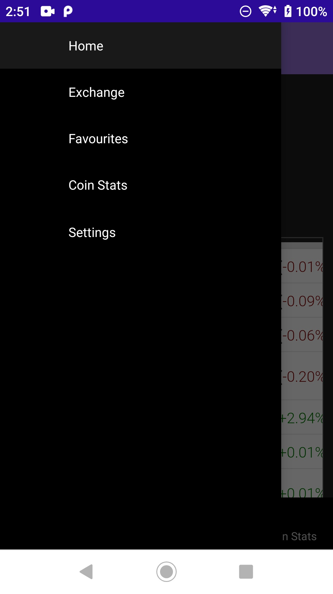
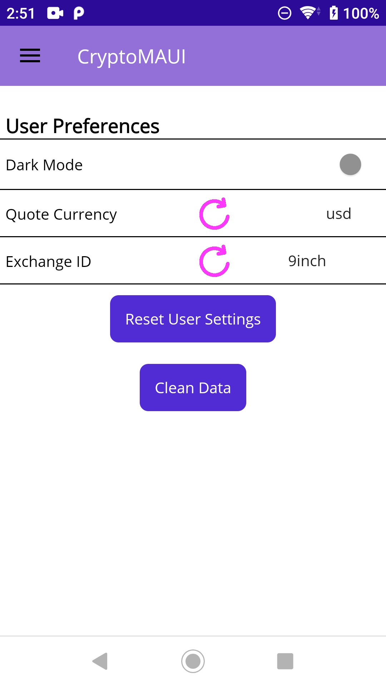
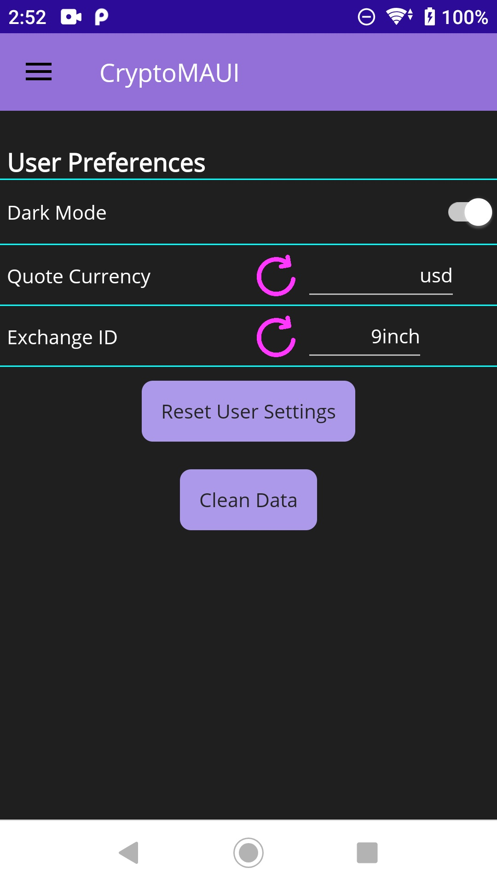
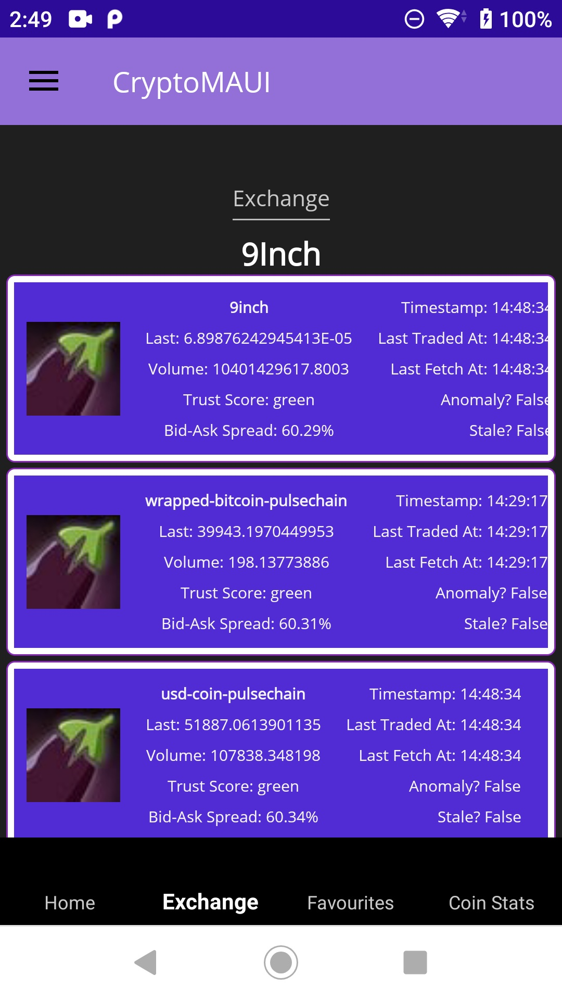
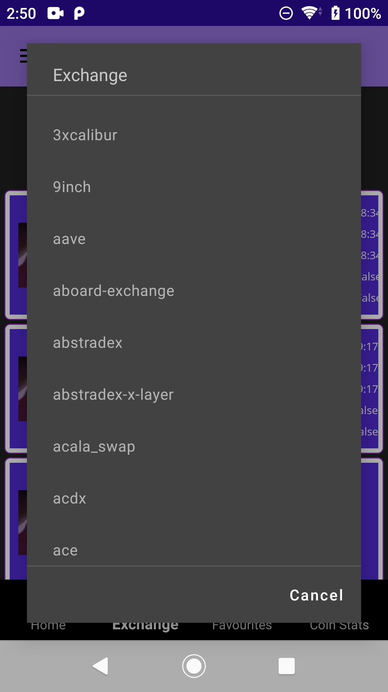
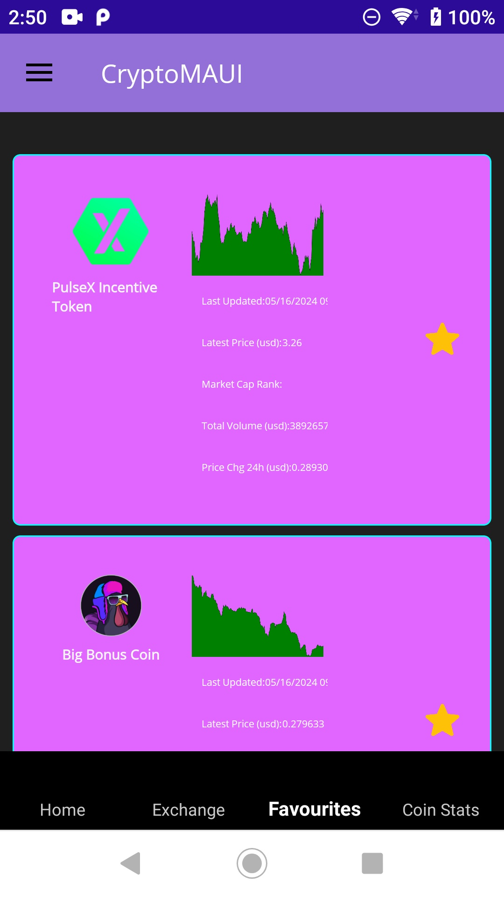
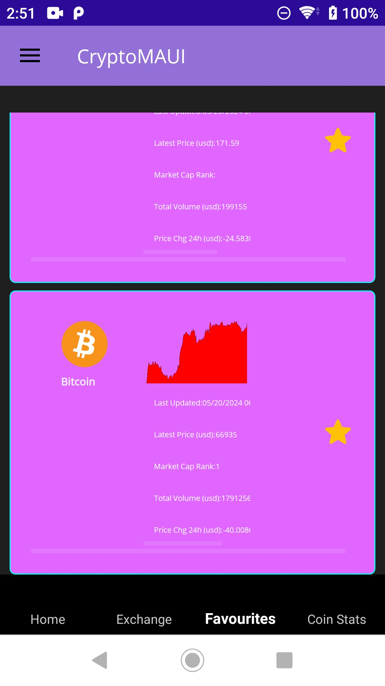
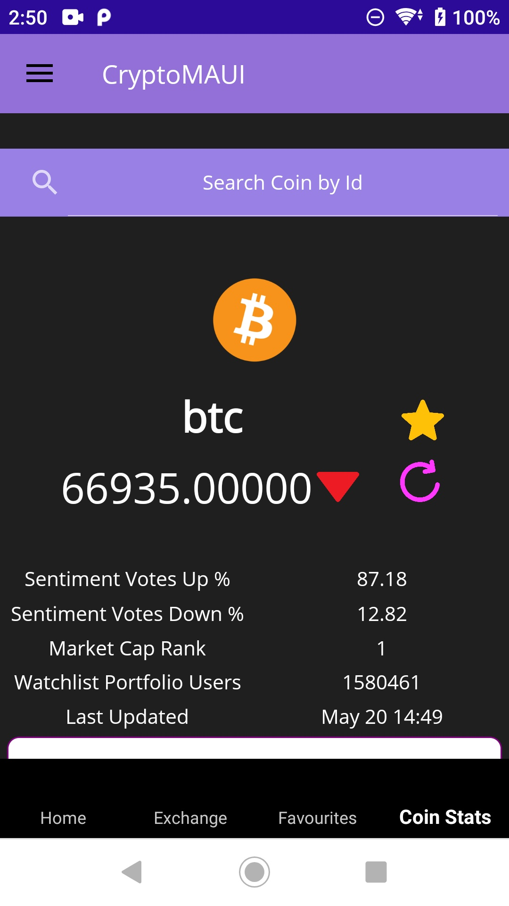
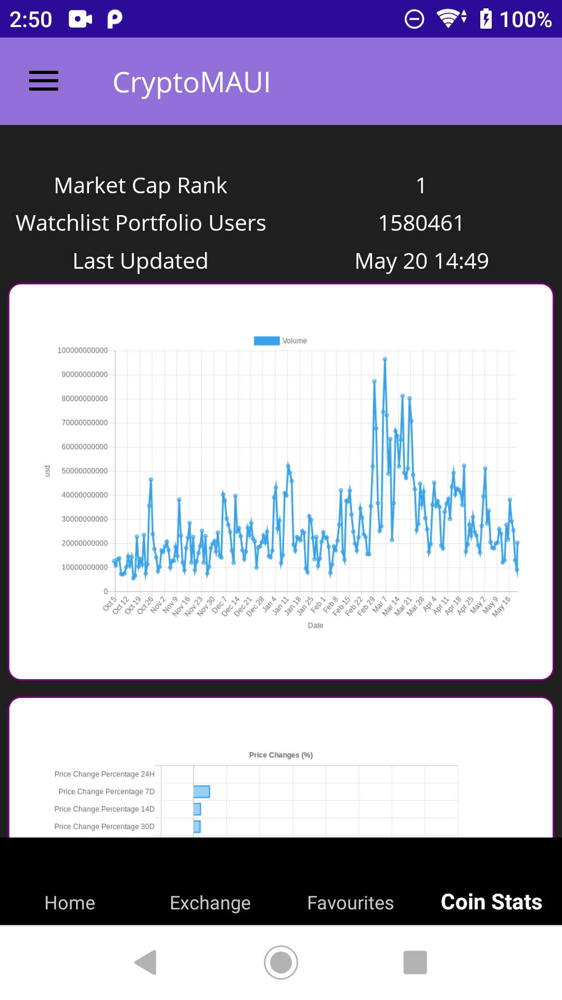
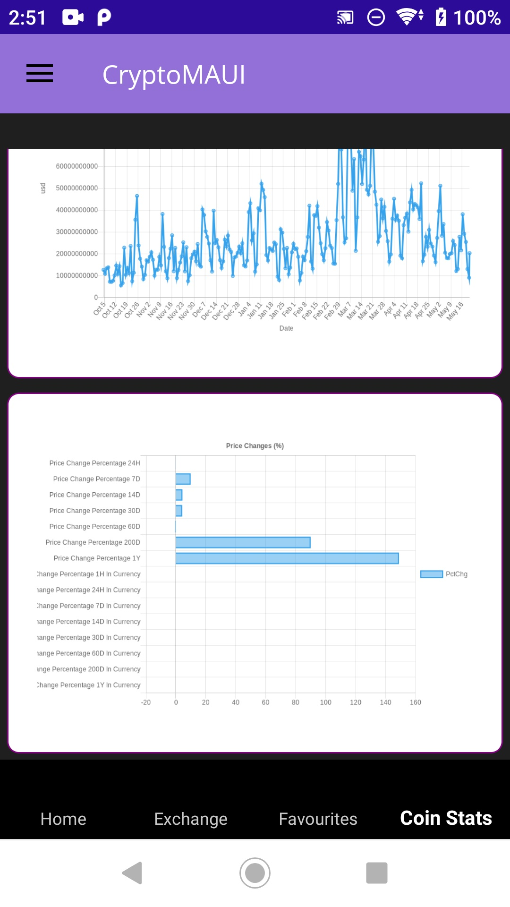

# CoinGeckoMAUI

CoinGeckoMAUI is a mobile application built with .NET MAUI, designed to provide users with cryptocurrency data and analytics. Leveraging the CoinGecko API, this app offers an intuitive experience for tracking the latest market information, prices, and other information on a wide range of cryptocurrencies.

## Features
- **Favorites**: Mark your favorite coins for quick access and personalized tracking.
- **Exchanges**: Select Coins from Multiple Exchanges.
- **Settings**: Customize the app according to your preferences, including theme settings.
- **Detailed Coin Information**: Access in-depth information about each coin, including historical data, charts, and market statistics.

## Screenshots

### Home Page

### Flyout Menu

### Settings Page

### Exchange Page

### Favourites Page

### Coin Stats Page

